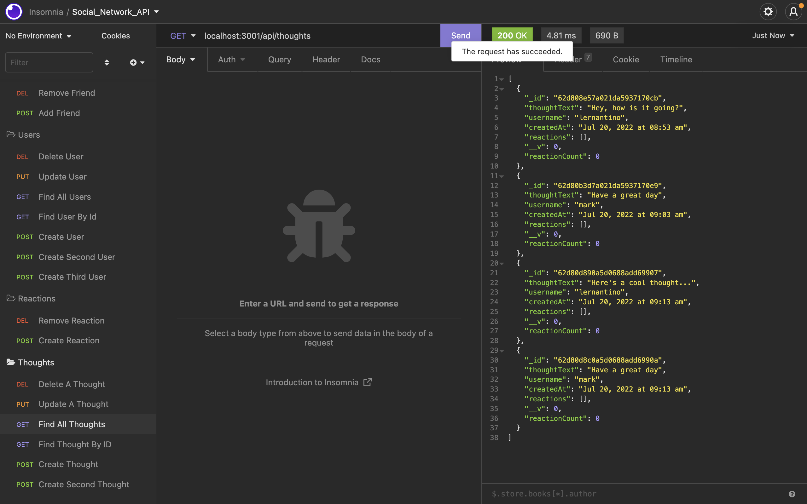

# social-network-api

## Table of Contents 
1. [Description](#description)
2. [Usage](#usage)
3. [Visuals](#visuals)
4. [Resources](#resources)

## Author:

Safwan Islam

## Description
In this challenge, there is code which builds out an API for a social network. Within this API, a user can create user, find all users, find single user by id, update and delete users.
The user can also do all the same things for thoughts. The user can add and delete a friend based on users, and also create and delete reactions to thoughts. The picture below is an example of the thoughts portion of the API. In part 2 of the video, the only example which was not working was the "update a thought" put route in the thought section, but it now works. Overall, this is an efficient way to create an API which would connect people in apps like facebook. 

## Usage
In order to start this code, the user should first run "npm init -y" in order to initialize the packages. Then the user should run "npm install express mongoose moment and nodemon" in order to get all the necessary extensions. Then the user should add a "start" script which runs "node server.js" and then run npm start in order to start the server at the correct port. Then the user can test routes in insomnia.

## Visuals

## Resources
[Video Pt.1 Link](https://drive.google.com/file/d/120VbOIhoxuEOBKeA_juNkMiV9Legu88U/view)

[Video Pt.2 Link](https://drive.google.com/file/d/1chw_7en63d3tcVA1sWFH3XWnA1qOz259/view)

[GitHub Repository](https://github.com/saislam10/social-network-api)